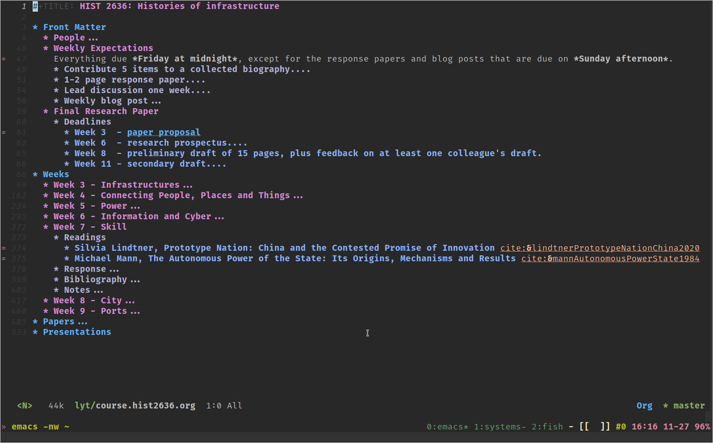
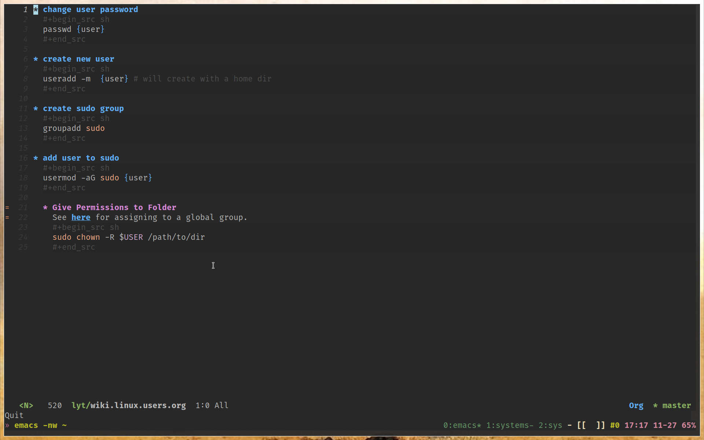
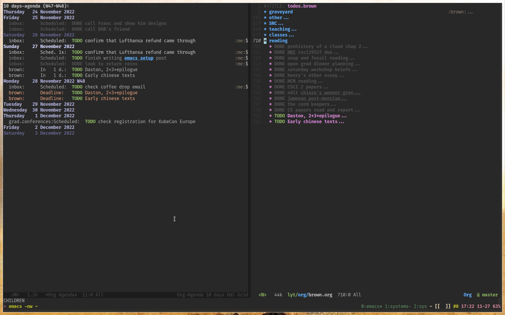
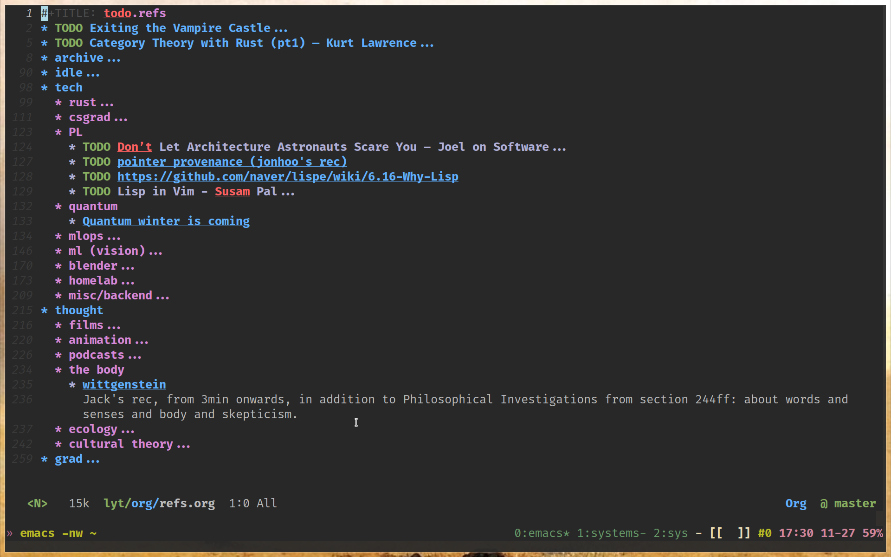

I've worked through a number of note-taking logics over the years.
When I was an undergraduate, I kept a swath of [GrowlyBird notes](https://growlybird.com/notes/).
Around 2015, I switched to [Bear notes](https://bear.app/), and dabbled with [Notion](https://www.notion.so/) in 2016 or so (when it was still relatively niche).
Through time working at [Forensic Architecture](https://forensic-architecture.org), I moved towards visual tools like [Mural](https://mural.co/) and [Miro](https://miro.com/) (and have found that [Figma](https://www.figma.com/) also works well in this class of tools).
In personal thinking these days, I mostly stick to Mural, as I have visual networks there that it doesn't make sense to try to port into any other tool.
More often though, I just use [tldraw](https://www.tldraw.com/) to quickly whiteboard ideas, and save the `.tldraw` files if I think I'll find those sketches useful in the future.

I check in with the [Roam Research](https://roamresearch.com/) and [Obsidian](https://obsidian.md/) communities from time-to-time, but ultimately feel the same way about note-taking as I do about my coding editor: I want shortcuts, hyperlinks, and suggestions, but I want it in a terminal. 
I'm already comfortable in a terminal; I know what fonts I like, I know how to UNIX through text to search and replace: I don't need a new GUI for what are, at core, hypertextual notes.

In most things programming, I have been a vim/[neovim](https://neovim.io/) user since 2018.
But it's damaging to be a die-hard in anything.
Especially vim, as I learned the hard way trying to develop [Apache Flink](https://flink.apache.org/) applications in Java with it.
(When I finally 'gave in' and starting using [IntelliJ](https://www.jetbrains.com/idea/), it was incredible how much more code I could understand and write.)
So in early 2020, I fell into using emacs to experiment with [Org mode](https://orgmode.org/), a markup format and ecosystem of tools that I initially wanted to adopt to replace the deprecated [Wunderlist](https://en.wikipedia.org/wiki/Wunderlist) (which I used extensively from 2013-2020).
At the suggestion of [zacoppotamus](https://github.com/zacoppotamus), I booted up [Doom Emacs](https://github.com/doomemacs/doomemacs) and pulled together [a config](https://github.com/breezykermo/.doom.d) that works for me.

If you're not interested in using Emacs or walking through my configuration,
I suggest that you skip straight to [Taking notes in
Org-mode](#taking-notes-in-org-mode), which showcases what kind of note-taking
is actually made possible through the configuration outlined in the first section.

# Doom Emacs Configuration
My [.doom.d](https://github.com/breezykermo/.doom.d) files are publicly
available online.
- [init.el](https://github.com/breezykermo/.doom.d/blob/master/init.el)
  controls which built-in [Doom modules](https://github.com/doomemacs/doomemacs/blob/master/docs/modules.org) are enabled.
- [packages.el](https://github.com/breezykermo/.doom.d/blob/master/packages.el)
  is for Emacs plugins that aren't packaged as Doom modules.
- [custom.el](https://github.com/breezykermo/.doom.d/blob/master/custom.el) is
  where Doom can set custom variables, but I generally don't mess with it.
- [config.el](https://github.com/breezykermo/.doom.d/blob/master/config.el) is
  where the gist of the config goes. I treat it as the main configuration file
  to modify when I want to change something in my setup.

`init.el` has reasonably descriptive comments pertaining to each package by
default. I''ve tried to pare it down to only include those modules that I know
I need and use regularly, as Doom's [default init.el](https://github.com/ztlevi/doom-config/blob/main/init.el)
leans toward the 'batteries included' approach (as this is one of Doom Emacs'
main selling point over just starting from plain old Emacs).

`packages.el` contains a few extra packages that I use which pertain to my
citation management when writing academic papers such as
[org-ref](https://github.com/jkitchin/org-ref) and `helm-bibtex` (more on this
below), some that make viewing PDFs nicer within Emacs such as
[image-roll](https://github.com/dalanicolai/image-roll.el), and some utility
packages for loading in git repos cleanly and easily converting markdown to
orgmode.

`config.el` is where most of my specific configuration sits. The first few
lines simply set my preferred fonts, transparency, and themes:

```lisp
(setq user-full-name "Lachlan Kermode"
      user-mail-address "lachiekermode@gmail.com")

;; FONTS, THEME et al
(setq doom-font (font-spec :family "Hack" :size 20)
       doom-variable-pitch-font (font-spec :family "Hack" :size 20))
(set-frame-parameter (selected-frame) 'alpha '(100 50))

(setq doom-theme 'doom-one)
(setq neo-theme (if (display-graphic-p) 'icons 'arrow))

(set-face-attribute 'default nil :height 120)
(setq display-line-numbers-type t)
```

Next I set up a `PKB_DIR`, where PKB stands for 'Personal Knowledge Base'. In
short, this is the folder in which I keep all of my notes, which are
a combination of Markdown (for historical reasons) and
[Org-mode](https://en.wikipedia.org/wiki/Org-mode) (which I generally now use
for everything). I also enable a feature of Org-mode TODOs that automatically
appends a timestamp into the front matter when I check off a TODO:

```lisp
;; ORG and DEFT
(setq PKB_DIR "~/Dropbox (Brown)/lyt")
(setq org-directory PKB_DIR)
(after! org
        (setq org-log-done 'time) ;; add timestamps to DONE
)
```


Next I add some shortcuts so that I have Vim-like window movement. As
I mention above, I still generally use a Tmux/Vim environment for development:
this Emacs setup is really only my note-taking application. As Emacs has the
option to run in a terminal, I simply run it within a Tmux pane, and it becomes
a part of my general development environment. (All of my dotfiles are public,
so you can peek at [my Vim config](https://github.com/breezykermo/.vim) and [my
Tmux config](https://github.com/breezykermo/larbs/tree/master/.config/tmux) if
you are curious):

```lisp
(map! "C-}"             #'next-buffer)
(map! "C-t"             #'previous-buffer)

(map! :desc "Vim-like window movement up"
      "C-k"             #'evil-window-up)
(map! :desc "Vim-like window movement down"
      "C-j"             #'evil-window-down)
(map! :desc "Vim-like window movement left"
      "C-h"             #'evil-window-left)
(map! :desc "Vim-like window movement right"
      "C-l"             #'evil-window-right)
(map! :leader
      (:prefix ("w" . "window")
      :desc "Tmux-like window split"
      "c"               #'evil-window-split))
(map! :leader
      :desc "Faster access of agenda"
      "a"               #'org-agenda-list)
```

Finally, I set up the `org-ref` package to interface nicely with a file that is
managed by [Zotero](https://www.zotero.org/), my citation manager of choice,
which is synced using Dropbox at `~/Dropbox (Brown)/lyt/references/master.bib`.
Whenever I want a text or source to be citable, I add it to my Zotero library.
(I don't use Zotero for any PDF storage, just for the citation metadata.) I use 
a plugin in Zotero called [Better BibTeX](https://retorque.re/zotero-better-bibtex/),
which keeps a BibTeX file (`master.bib`) updated when I add and remove
citations from my Zotero library. This effectively makes `master.bib` a source
of truth for the citations I want to potentially insert in pieces that I am
writing. (I insert citations in Zotero through the mechanisms it provides, i.e.
through its [browser extensions](https://www.zotero.org/download/connectors) or 
manually in some cases.)

The complementary configuration in Emacs is the following, which configures
`helm-bibtex` to provide a selection menu that reads from `master.bib` when
I enter the shortcut `C-c ]` in an Org-mode file:

```lisp
;; citations
;; following https://jonathanabennett.github.io/blog/2019/05/29/writing-academic-papers-with-org-mode/
(use-package helm-bibtex
    :custom
    (helm-bibtex-bibliography '("~/Dropbox (Brown)/lyt/references/master.bib"))
    (reftex-default-bibliography '("~/Dropbox (Brown)/lyt/references/master.bib"))
    (bibtex-completion-pdf-field "file")
    :hook (Tex . (lambda () (define-key Tex-mode-map "\C-ch" 'helm-bibtex))))

(use-package org-ref
    :custom
    (org-ref-default-bibliography "~/Dropbox (Brown)/lyt/references/master.bib"))
```

One of the main reasons that I use Org-mode so extensively is that it provides
extensive and configurable ways to export to other formats such as PDF and
HTML. When I am writing an academic paper, for example, I can export any
Org-mode markup through an intermediary [LaTeX](https://www.latex-project.org/)
engine, allowing me to beautify it however I might need.

Critically, the `org-ref` plugin magics together citations in the PDF output,
auto-generating a bibliography provided that I specify it in the output. The
following configuration brings in some custom styles for certain kinds of PDF
output generated in this way:

```lisp
(add-to-list 'org-latex-classes
            '("apa6"
                "\\documentclass{apa6}"
                ("\\section{%s}" . "\\section*{%s}")
                ("\\subsection{%s}" . "\\subsection*{%s}")
                ("\\subsubsection{%s}" . "\\subsubsection*{%s}")
                ("\\paragraph{%s}" . "\\paragraph*{%s}")
                ("\\subparagraph{%s}" . "\\subparagraph*{%s}")))
(add-to-list 'org-latex-classes
            '("acmart"
                "\\documentclass{acmart}"
                ("\\section{%s}" . "\\section*{%s}")
                ("\\subsection{%s}" . "\\subsection*{%s}")
                ("\\subsubsection{%s}" . "\\subsubsection*{%s}")
                ("\\paragraph{%s}" . "\\paragraph*{%s}")
                ("\\subparagraph{%s}" . "\\subparagraph*{%s}")))


; (setq org-latex-pdf-process '("latexmk -shell-escape -bibtex -pdf %f"))
(setq org-latex-pdf-process
'("latexmk -pdflatex='pdflatex -interaction nonstopmode' -shell-escape -pdf -bibtex -f %f"))
(define-key org-mode-map (kbd "C-c ]") 'org-ref-insert-link)
```

Finally, I include a couple of other hacks that I've found useful; the first to
open links from emacs in Firefox, and the next to provide a shortcut to convert
Markdown files to Org-mode:

```lisp
(setq browse-url-browser-function 'browse-url-generic
      browse-url-generic-program "firefox")

;; conversion from markdown to orgmode
(use-package! org-pandoc-import :after org)
```

# Taking notes in Org-mode
The configuration outlined above puts all the necessary pieces in place to
allow me to do all my writing in Emacs: lecture/seminar/meeting notes, homework
assignments, academic papers both in the humanities and for computer science,
technical cheatsheets for coding, day-to-day TODO lists, more durable lists of
links; and all other important things in my life that I feel need to or should
be written down.

The rest of this post talks through examples in each of those categories, and
concludes by pointing to the more general philosophy of note-taking that is
starting to cohere for me through the daily use of these tools. 

## Lecture/seminar/meeting notes
The format for lectures, seminars, and side projects often want similar kinds
of notes.
Typically there is some 'front matter' associated with the course, which
consists of links to the course website, to a syllabus, to a calendar, etc.
I typically bring forward any context that I want to have accessible whenever
I open up the note for that course. Here's an example of a note for a course
I took at Harvard in Fall 2021 called *Histories of Infrastructure* with
[Arunabh Ghosh](https://scholar.harvard.edu/arunabh.ghosh/home):



Note the hierarchical structure of the note, as in Org-mode a set of `*`s at
the beginning of a line indicates a new section or subsection. This
functionality is fairly critical to the way I take notes, as it allows me to
write notes that are arbitrarily large in terms of the amount of text they
contain, so long as there are conceptually clean layers of headings. In my Doom
Emacs setup I can toggle individual headings as open or closed using `<Tab>`,
and can toggle open or closed all headings at a particular level of
hierarchical indentation using `<Shift+Tab>`

## Academic papers (humanities)
Org-mode allows external things, such as to URLs in the browser, but it also
allows links to other local files. This means that I can create networks of
files that are associated to each other, much like in Obsidian or in Roam.
(There are plugins to Emacs like [org-roam](https://www.orgroam.com/) that keep
track of internal links and show a backlinks pane, but I found that I didn’t
really use this feature, perhaps due to the way that I organize my notes, or
perhaps because my personal knowledge base is not yet detailed enough that
I need this feature.)

If I follow through to the link under `Final Research Paper > Deadlines > Week
3 - paper proposal` in the screenshot above, Emacs brings up another Org-mode
file in which I wrote the paper proposal that I submitted for the class. This
is the full environment in which I write academics proposals and papers, as it
includes all of the citational bells and whistles I configured in the [previous
section](#doom-emacs-configuration). On the left-hand side is the Org-mode text
in Emacs, on the right-hand side is the PDF that is produced when I run
a render command:


The key aspect here is that the bits of text that are highlighted orange on the
left-hand side, which have been entered in by way of a selection menu with all
of the citations in my Zotero library, are transformed into legitimate
Chicago-style citations in the rendered PDF. The selection menu in my
configuration allows me to enter a page number in addition to selecting the
source citation text, and any text that I cite in the document will be
automatically added to the 'References' section at the end.

Any other styling from the Org-mode source, such as bold and italic text, or
hyperlinked text, will be reflected in the PDF output. Special line prefixes,
such as those in a darker gray at the top of the source document, allow me to
directly style and/or configure the output using LaTeX.

This tooling makes it incredibly straightforward for me to move from draft to
publication-ready documents, as all of my writing sits in the same envionment,
from stray thoughts I just jotted down to pieces that I finished months ago.
Org-mode's export capabilities are not limited to PDF: through a similar
process I can also export writing to HTML files (for publication on the web),
Markdown, ODT (to upload to a platform such as Google Docs for comments, say),
and even to a [revealjs](https://revealjs.com/) presentation, the framework
I use for created slides for lectures and talks.

## Academic papers (computer science)
This writing environment also means that it is straightforward to style pieces
of text using different style guides, column formats, and citation styles.
Here, for example, is a homework I submitted for a graduate seminar on
distributed systems in computer science:


Note that in addition to producing a rendered PDF with two columns, this
document also showcases Org-modes syntax highlighting capacities. Mathematical
symbols are also supported, as are many other typographies for which one would
otherwise have to turn to raw LaTeX.

## Technical cheatsheets
A much more incremental form of writing that I do is composing cheatsheets for
different software and programming languages that I use. Org-mode supports
syntax highlighting (or at least, Org-mode in my variation of Doom Emacs does),
so I have a flutter of `wiki` files like the `wiki.linux.users.org` shown
below:



Like all of my Org-mode notes, these cheatsheets are available through a fuzzy
search bar that I can bring up anywhere in Emacs with the `SPC .` shortcut; so
it's easy to whip up examples of the commands I need when I can't remember them.
## Day-to-day TODO lists
Org-mode's TODO management capability is the original reason that I switched my
daily note-taking to it from Markdown. I don't use it in a particularly
original way, but for completeness here is a screenshot of my agenda next to
the source file in which I keep my academic TODOs (I am currently a graduate
student at [Brown University](https://brown.edu)):



The agenda view (left) aggregates TODOs from multiple files and orders them
according to their `SCHEDULED` and `DEADLINE` annotations, giving me a clear
frame on what's urgent. I keep most of my TODOs in less than 5 files that have
names representing main containers in which I have things to do, such as my
university (`brown.org`), my personal life (`inbox.org`), and a few others.
When I don't have urgent TODOs to address, I look through non-urgent TODOs,
sometimes escalating them. (For a more thorough philosophy with respect to
processing TODOs in Org-mode, see [Jethro Kuan's Org workflow
series](https://blog.jethro.dev/posts/processing_inbox/).) 

## Durable lists of links
In addition to the TODOs that I keep in files organized according to my life's
main containers, I also keep a `refs.org` file that I use an an inbox for
interesting links across a range of different areas:



There is generally no time-frame associated with these TODOs: they rather
represent links that I find interesting and want to conceptually 'archive'
away. On the best of weekends, I sit down and read some of these links, and
shovel them off to different `wiki` files if relevant, or mark them `DONE` and
move them to the "archive" heading if I don't have an immediate categorization
for them.

I have various ways of getting links to this file on the go. I use
[beorg](https://beorgapp.com/) on my iPhone (shameful, I know) to read and
write the `refs` and other TODO files, and as they all sit in Dropbox these
modifications are synchronized across my one and a half computers. (I use Arch
Linux on a laptop as my main driver, but am still tied to a Mac Mini that
I keep in my office for certain applications and workflows.) Alternatively, if
I have access to a keyboard, I can SSH into a machine that is set up syncing
with my Dropbox and use Emacs directly in any terminal.

## Some final thoughts 
Emacs is really working for me, not just as a way to take notes, but as a way
to think by way of a hypertextual archive that I incrementally curate even as
I reference and read its tidbits. I was quite taken with organizational
philosophies like [Zettelkasten](https://zettelkasten.de/introduction/) when
I first came across them, and I still imagine that I have a lot to learn about
thinking by experimenting with them. But the fact of being comfortable with
a system is much more important than the features of the system itself, a maxim
that has substance in both note-taking and in programming more generally. Many
thinkers whose process I deeply respect have [hardly any note-taking process at
all](https://youtu.be/01V-0YkEd0M?t=4066), and I personally don't think that
note-taking as a system should be treated an end in itself. (With one possible
exception being if you consider yourself the developer or maintainer of
a note-taking application, I suppose.)

If you have any issues getting any of my configs working, don't hesitate to
[open an issue](https://github.com/breezykermo/.doom.d/issues/new) on my
dotfile repos. I'd like for them to be generic across operating systems and
distributions, but they're tuned to my machines and will probably not work out
of the box on others.
